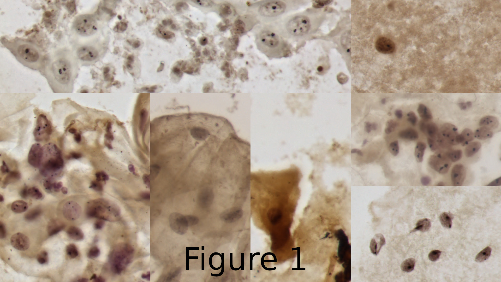
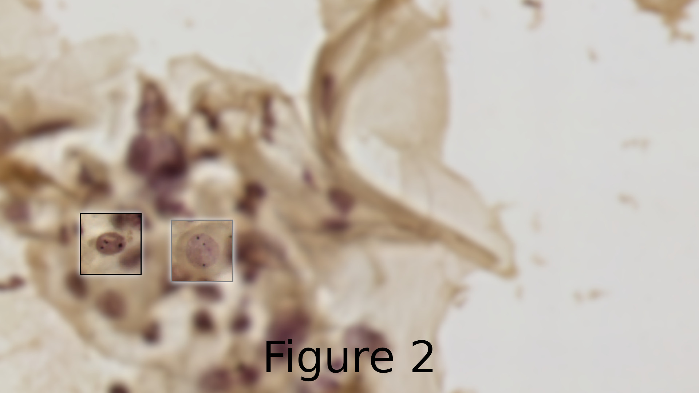

[](https://pypi.org/project/CCAgT-utils/)
[](https://codecov.io/gh/johnnv1/CCAgT-utils)
[](https://results.pre-commit.ci/latest/github/johnnv1/CCAgT-utils/main)
[](https://github.com/johnnv1/CCAgT-utils/actions/workflows/main.yml)
[](https://zenodo.org/badge/latestdoi/456516174)

# CCAgT-utils

CCAgT-utils it's a package to work with the **CCAgT dataset**: `Images of Cervical Cells with AgNOR Stain Technique`. The package will provide some customized codes for annotations format conversion, mask generation, plotting samples, etc.


## Package context
I have been working with images of cervical cells stained with AgNOR since January/2020 for my master thesis. The results of my thesis you can find at [CCAgT-benchmarks](https://github.com/johnnv1/CCAgT-benchmarks). In general, the objective of the thesis it's automatize the principal part to help at the diagnostic/prognostic of these cells. Therefore, I also have developed some codes to preprocess or just to help in the use of this dataset.


These codes to work with the dataset will be available at this package.

## Contents

1. [Links to download the dataset](#links-to-download-the-ccagt-dataset)
2. [What is this dataset like?](#what-is-this-dataset-looks-like)
3. [Examples of use of this package](#examples-of-use)


# Links to download the CCAgT dataset

1. Version 1.1 - [drive](https://drive.google.com/drive/folders/1TBpYCv6S1ydASLauSzcsvO7Wc5O-WUw0?usp=sharing) or [UFSC repository](https://arquivos.ufsc.br/d/373be2177a33426a9e6c/)
2. Version 2.1 (will be available soon) - [Mendeley data](https://doi.org/10.17632/wg4bpm33hj.1)

# What is this dataset looks like?
Explanations and examples around the `>=2.0` version of the dataset. If you want to use older versions of the dataset, you will need to make some modifications to the data directory organizations, or things like that.


This is a computer vision dataset, created by some collaborators from different departments at [Universidade Federal de Santa Catarina (UFSC)](https://en.ufsc.br/). The dataset contains images annotated/labelled for semantic segmentation and others. The annotation tool is [labelbox](https://labelbox.com/). In the data repositories will the images, masks (semantic segmentation) and COCO annotations for object detection. The codes to convert annotations from labelbox format to others will be in this package.

Each slide can have some differences in the stain coloration, at figure 1 can be seen an image created from different images of different slides.



In directory [./data/samples/images/](./data/samples/images/) can be seen the original images of each tile from different slides/patients. The dataset present a wide variety of colors, texture, nuclei format, and others for the cells nuclei, this variety depends on different factors as: Type of lesion, stain process, sample acquisition, sensor/microscopy setup for image acquisition and others.

The dataset at version `1.x` has 3 categories annotated, and at version `2.x` will have 7 categories. But, the principal objective to help at diagnostic/prognostic of these samples is to detect/identify/measure the Nucleolus Organizer Regions (NORs) inside each nucleus. The NORs (the black dots/parts inside the nuclei) were labeled as two different categories: Satellite and clusters.

At figure 2, has an example with two highlighted nuclei. The nucleus at left (black highlighted) it's a nucleus with three clusters. The nucleus at right side (gray highlighted) it's a nucleus with one cluster (the black dot at the top of the nuclei) and two satellites (the other two black dots).



For more explanations about the dataset, see the dataset pages, or their papers.


# Examples of use

## Converter
To use the dataset along different approaches, different “formats” are required. This module will provide the correct transformation between the format provided by the annotation tool (LabelBox) and the current state-of-the-art formats (e.g. COCO). It will also make it possible to work with the data in DataFrame format, which I consider to be the easiest way to perform the manipulation of these annotations. The annotations dataframe format is not recommended or built for use in any specific deep learning library or approach. It was built only for manipulation of the dataset, to facilitate conversions between different formats, perform analysis, and internal use of this library.

```console
$ CCAgT-converter -h  # to show help message
```

### Labelbox to COCO format
```console
$ CCAgT-converter labelbox_to_COCO -t OD -r ./data/samples/sanitized_sample_labelbox.json\
                                         -a ./data/samples/CCAgT_dataset_metadata.json\
                                         -o ./data/samples/out/CCAgT_COCO_OD.json
```

### Labelbox to CCAgT format
```console
$ CCAgT-converter labelbox_to_CCAgT -r ./data/samples/sanitized_sample_labelbox.json \
                                    -a ./data/samples/CCAgT_dataset_metadata.json \
                                    -o ./data/samples/out/CCAgT.parquet.gzip\
                                    -p True
```
### CCAgT to masks (categorical masks for semantic segmentation)
```console
$ CCAgT-converter generate_masks -l ./data/samples/out/CCAgT.parquet.gzip\
                                 -o ./data/samples/masks/semantic_segmentation/\
                                 --split-by-slide
```

### CCAgT to Panoptic segmentation COCO
```console
$ CCAgT-converter CCAgT_to_COCO  -t PS -l ./data/samples/out/CCAgT.parquet.gzip\
                                       -o ./data/samples/masks/panoptic_segmentation\
                                       --out-file ./data/samples/out/CCAgT_COCO_PS.json
```


## Create subdataset's
Module responsible to create personalized versions of the dataset with the desired
modifications. Things that can be done: slice the images into smaller parts, select
just images that have specific categories, create images with a specific category.
This tool, will copy, or generate the images, and also generate a new CCAgT annotations
file, based on the desired options!

First, if desired, the tool will remove images that do not have the desired categories:
>- `--remove-images-without` with the categories ids, will remove all images
that don't have the categories passed as parameter.
>- `--remove-annotations-different` with the categories ids, will remove all annotations
that have different categories than the parameter.

Second, the tool allows selecting what will be the format of the images:
>- `--slice-images` to slice the images into sub parts;
>- `--extract` to create images with a unique category (centralized
into the new image);
>- `--labels` (to be used with `--extract`) path for the CCAgT file with the labels;
>- `--paddings` (to be used with `--extract`) in percent (float values) or pixels
(integer values) select, the size of paddings to apply;
>- Without any parameter, will just copy the original dataset

Third, and last, can (re)check if all images has the desired categories, and delete
with don't have.
>- `--check-if-all-have-at-least-one-of` to verify if the image have at least
one of the categories IDs passed as parameter;
>- `--delete` if desired, delete images that don't have at least one of the categories.
>- `--generate-masks` if desired, will generate the masks based on the new CCAgT
annotations file.

**Check all option with: ** `CCAgT-utils create-subdataset -h`

Example creates a subdataset with images sliced into 2x2 (1 image (1600x1200) ->
4 images (800x600)), and remove images do not have any information (images with
just background).

```console
# Create a directory with the same structure of the dataset
$ mkdir /tmp/example_dataset
$ mkdir /tmp/example_dataset/images/
$ mkdir /tmp/example_dataset/masks/
$ cp -r ./data/samples/images/ /tmp/example_dataset/images/
$ cp -r ./data/samples/masks/semantic_segmentation/ /tmp/example_dataset/masks/

# Create the subdataset
$ CCAgT-utils create-subdataset -name dataset_sliced_into2x2 \
                                --original /tmp/example_dataset/ \
                                --output /tmp/ \
                                --remove-images-without 1 2 3 4 5 6 7\
                                --slice-images 2 2
```

With this tool, various datasets (based on the original dataset) can be created,
be creative 😊 at yours experiments.

## visualization
Module responsible for assisting in the display or creation of figures from the dataset.

```console
usage: CCAgT-visualization -h  # to show help message
```

### Show images with boxes
```console
$ CCAgT-visualization show -l ./data/samples/out/CCAgT.parquet.gzip\
                           -a ./data/samples/CCAgT_dataset_metadata.json\
                           -d ./data/samples/images/
```

### Show images and mask
```console
$ CCAgT-visualization show -t image-and-mask\
                           -l ./data/samples/out/CCAgT.parquet.gzip\
                           -a ./data/samples/CCAgT_dataset_metadata.json\
                           -d ./data/samples/images/\
                           -m ./data/samples/masks/semantic_segmentation/
```

### Show image with boxes and mask
```console
$ CCAgT-visualization show -t image-with-boxes-and-mask\
                           -l ./data/samples/out/CCAgT.parquet.gzip\
                           -a ./data/samples/CCAgT_dataset_metadata.json\
                           -d ./data/samples/images/\
                           -m ./data/samples/masks/semantic_segmentation/
```
